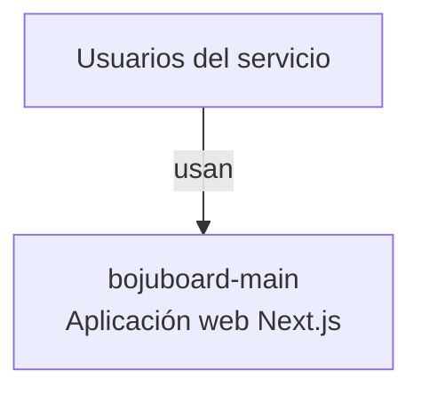
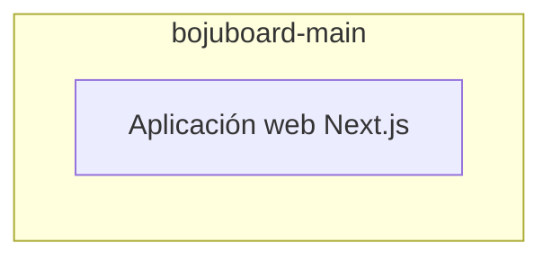

# Informe central — bojuboard-main

> Auditoría generada por **VibeAudit**. Este documento reúne todos los entregables del análisis.

## 1. Datos del proyecto

- **Repositorio:** —
- **Rama:** —
- **Commit:** —
- **Lenguajes:** CSS, JavaScript, TypeScript
- **Frameworks:** Next.js
- **Líneas de código:** 47536
- **Archivos de test:** 0

## 2. Resumen ejecutivo

| Sección | Hallazgos |
|---|---:|
| sast | 0 |
| secrets | 0 |
| iac | 0 |
| cicd | 0 |
| custom | 82 |
| cloud | 0 |
| llm | 10 |
| deps | 66 |
| **Total** | **158** |

**Por severidad:** CRITICAL x 2, HIGH x 46, MEDIUM x 93, LOW x 17

## 3. Diagrama C4 — Contexto (nivel 1)

## 4. Diagrama C4 — Contenedores (nivel 2)

## 5. Roadmap de remediación por fases

# Roadmap de remediación — bojuboard-main

**Repositorio:** —

**Total de hallazgos considerados:** 158

## Fase 1

Remediación inmediata (0-2 semanas): riesgos graves o explotables.

| ID | Tipo | Regla | Archivo | Severidad |
|---|---|---|---|---|
| `llm-Dependencia vulnerable` | llm | `Dependencia vulnerable` |  | **CRITICAL** |
| `llm-Dependencia vulnerable` | llm | `Dependencia vulnerable` |  | **HIGH** |
| `llm-Dependencia vulnerable` | llm | `Dependencia vulnerable` |  | **HIGH** |
| `deps-@babel/plugin-transform-modules-systemjs@7.29.0` | deps | `@babel/plugin-transform-modules-systemjs@7.29.0` |  | **HIGH** |
| `deps-ajv@6.12.6` | deps | `ajv@6.12.6` |  | **HIGH** |
| `deps-brace-expansion@2.0.2` | deps | `brace-expansion@2.0.2` |  | **HIGH** |
| `deps-brace-expansion@2.0.2` | deps | `brace-expansion@2.0.2` |  | **HIGH** |
| `deps-brace-expansion@2.0.2` | deps | `brace-expansion@2.0.2` |  | **HIGH** |
| `deps-fast-uri@3.1.0` | deps | `fast-uri@3.1.0` |  | **HIGH** |
| `deps-fast-uri@3.1.0` | deps | `fast-uri@3.1.0` |  | **HIGH** |
| `deps-fast-uri@3.1.0` | deps | `fast-uri@3.1.0` |  | **HIGH** |
| `deps-fast-uri@3.1.0` | deps | `fast-uri@3.1.0` |  | **HIGH** |
| `deps-fast-uri@3.1.0` | deps | `fast-uri@3.1.0` |  | **HIGH** |
| `deps-flatted@3.3.3` | deps | `flatted@3.3.3` |  | **HIGH** |
| `deps-flatted@3.3.3` | deps | `flatted@3.3.3` |  | **HIGH** |
| `deps-js-yaml@4.1.1` | deps | `js-yaml@4.1.1` |  | **HIGH** |
| `deps-lodash@4.17.23` | deps | `lodash@4.17.23` |  | **HIGH** |
| `deps-minimatch@9.0.5` | deps | `minimatch@9.0.5` |  | **HIGH** |
| `deps-minimatch@9.0.5` | deps | `minimatch@9.0.5` |  | **HIGH** |
| `deps-minimatch@9.0.5` | deps | `minimatch@9.0.5` |  | **HIGH** |
| `deps-next@14.2.15` | deps | `next@14.2.15` |  | **HIGH** |
| `deps-next@14.2.15` | deps | `next@14.2.15` |  | **HIGH** |
| `deps-next@14.2.15` | deps | `next@14.2.15` |  | **HIGH** |
| `deps-next@14.2.15` | deps | `next@14.2.15` |  | **HIGH** |
| `deps-next@14.2.15` | deps | `next@14.2.15` |  | **HIGH** |
| `deps-next@14.2.15` | deps | `next@14.2.15` |  | **HIGH** |
| `deps-next@14.2.15` | deps | `next@14.2.15` |  | **HIGH** |
| `deps-next@14.2.15` | deps | `next@14.2.15` |  | **HIGH** |
| `deps-next@14.2.15` | deps | `next@14.2.15` |  | **HIGH** |
| `deps-next@14.2.15` | deps | `next@14.2.15` |  | **HIGH** |
| `deps-next@14.2.15` | deps | `next@14.2.15` |  | **CRITICAL** |
| `deps-next@14.2.15` | deps | `next@14.2.15` |  | **HIGH** |
| `deps-next@14.2.15` | deps | `next@14.2.15` |  | **HIGH** |
| `deps-next@14.2.15` | deps | `next@14.2.15` |  | **HIGH** |
| `deps-next@14.2.15` | deps | `next@14.2.15` |  | **HIGH** |
| `deps-next@14.2.15` | deps | `next@14.2.15` |  | **HIGH** |
| `deps-next@14.2.15` | deps | `next@14.2.15` |  | **HIGH** |
| `deps-picomatch@2.3.1` | deps | `picomatch@2.3.1` |  | **HIGH** |
| `deps-postcss@8.4.31` | deps | `postcss@8.4.31` |  | **HIGH** |
| `deps-postcss@8.4.31` | deps | `postcss@8.4.31` |  | **HIGH** |
| `deps-postcss@8.4.31` | deps | `postcss@8.4.31` |  | **HIGH** |
| `deps-rollup@2.79.2` | deps | `rollup@2.79.2` |  | **HIGH** |
| `deps-serialize-javascript@4.0.0` | deps | `serialize-javascript@4.0.0` |  | **HIGH** |
| `deps-tmp@0.2.5` | deps | `tmp@0.2.5` |  | **HIGH** |
| `deps-uuid@8.3.2` | deps | `uuid@8.3.2` |  | **HIGH** |
| `deps-ws@8.18.3` | deps | `ws@8.18.3` |  | **HIGH** |
| `deps-xlsx@0.18.5` | deps | `xlsx@0.18.5` |  | **HIGH** |
| `deps-xlsx@0.18.5` | deps | `xlsx@0.18.5` |  | **HIGH** |

## Fase 2

Remediación a corto plazo (2-6 semanas): endurecer y reducir superficie.

| ID | Tipo | Regla | Archivo | Severidad |
|---|---|---|---|---|
| `custom-vibe-js-console-log` | custom | `vibe-js-console-log` | src/app/api/bojucalendar/user-role/route.ts:30 | **MEDIUM** |
| `custom-vibe-js-console-log` | custom | `vibe-js-console-log` | src/app/api/bojucontratos/analyze/route.ts:15 | **MEDIUM** |
| `custom-vibe-js-console-log` | custom | `vibe-js-console-log` | src/app/api/bojucontratos/analyze/route.ts:16 | **MEDIUM** |
| `custom-vibe-js-console-log` | custom | `vibe-js-console-log` | src/app/api/bojucontratos/analyze/route.ts:17 | **MEDIUM** |
| `custom-vibe-js-console-log` | custom | `vibe-js-console-log` | src/app/api/bojucontratos/analyze/route.ts:21 | **MEDIUM** |
| `custom-vibe-js-console-log` | custom | `vibe-js-console-log` | src/app/api/bojucontratos/analyze/route.ts:33 | **MEDIUM** |
| `custom-vibe-js-console-log` | custom | `vibe-js-console-log` | src/app/api/bojucontratos/analyze/route.ts:58 | **MEDIUM** |
| `custom-vibe-js-console-log` | custom | `vibe-js-console-log` | src/app/api/bojucontratos/analyze/route.ts:61 | **MEDIUM** |
| `custom-vibe-js-console-log` | custom | `vibe-js-console-log` | src/app/api/bojucontratos/analyze/route.ts:88 | **MEDIUM** |
| `custom-vibe-js-console-log` | custom | `vibe-js-console-log` | src/app/api/bojucontratos/analyze/route.ts:91 | **MEDIUM** |
| `custom-vibe-js-console-log` | custom | `vibe-js-console-log` | src/app/api/bojucontratos/analyze/route.ts:95 | **MEDIUM** |
| `custom-vibe-js-console-log` | custom | `vibe-js-console-log` | src/app/api/bojucontratos/analyze/route.ts:107 | **MEDIUM** |
| `custom-vibe-js-console-log` | custom | `vibe-js-console-log` | src/app/api/bojucontratos/analyze/route.ts:108 | **MEDIUM** |
| `custom-vibe-js-console-log` | custom | `vibe-js-console-log` | src/app/api/bojucontratos/analyze/route.ts:109 | **MEDIUM** |
| `custom-vibe-js-console-log` | custom | `vibe-js-console-log` | src/app/api/bojucontratos/obras/route.ts:12 | **MEDIUM** |
| `custom-vibe-js-console-log` | custom | `vibe-js-console-log` | src/app/api/bojucontratos/save-result/route.ts:15 | **MEDIUM** |
| `custom-vibe-js-console-log` | custom | `vibe-js-console-log` | src/app/api/bojucontratos/save-result/route.ts:16 | **MEDIUM** |
| `custom-vibe-js-console-log` | custom | `vibe-js-console-log` | src/app/api/bojucontratos/save-result/route.ts:17 | **MEDIUM** |
| `custom-vibe-js-console-log` | custom | `vibe-js-console-log` | src/app/api/bojucontratos/save-result/route.ts:21 | **MEDIUM** |
| `custom-vibe-js-console-log` | custom | `vibe-js-console-log` | src/app/api/bojucontratos/save-result/route.ts:33 | **MEDIUM** |
| `custom-vibe-js-console-log` | custom | `vibe-js-console-log` | src/app/api/bojucontratos/save-result/route.ts:39 | **MEDIUM** |
| `custom-vibe-js-console-log` | custom | `vibe-js-console-log` | src/app/api/bojucontratos/save-result/route.ts:52 | **MEDIUM** |
| `custom-vibe-js-console-log` | custom | `vibe-js-console-log` | src/app/api/bojucontratos/save-result/route.ts:79 | **MEDIUM** |
| `custom-vibe-js-console-log` | custom | `vibe-js-console-log` | src/app/api/bojucontratos/save-result/route.ts:95 | **MEDIUM** |
| `custom-vibe-js-console-log` | custom | `vibe-js-console-log` | src/app/api/bojucontratos/save-result/route.ts:106 | **MEDIUM** |
| `custom-vibe-js-console-log` | custom | `vibe-js-console-log` | src/app/api/bojucontratos/save-result/route.ts:129 | **MEDIUM** |
| `custom-vibe-js-console-log` | custom | `vibe-js-console-log` | src/app/api/bojucontratos/save-result/route.ts:130 | **MEDIUM** |
| `custom-vibe-js-console-log` | custom | `vibe-js-console-log` | src/app/api/bojucontratos/save-result/route.ts:131 | **MEDIUM** |
| `custom-vibe-ts-non-null-assertion` | custom | `vibe-ts-non-null-assertion` | src/app/bojualmacen/historial/page.tsx:67 | **MEDIUM** |
| `custom-vibe-ts-non-null-assertion` | custom | `vibe-ts-non-null-assertion` | src/app/bojualmacen/historial/page.tsx:67 | **MEDIUM** |
| `custom-vibe-ts-non-null-assertion` | custom | `vibe-ts-non-null-assertion` | src/app/bojualmacen/movimiento/page.tsx:200 | **MEDIUM** |
| `custom-vibe-ts-non-null-assertion` | custom | `vibe-ts-non-null-assertion` | src/app/bojuboard/BojuBoardMobile.tsx:150 | **MEDIUM** |
| `custom-vibe-ts-non-null-assertion` | custom | `vibe-ts-non-null-assertion` | src/app/bojuboard/BojuBoardMobile.tsx:153 | **MEDIUM** |
| `custom-vibe-ts-non-null-assertion` | custom | `vibe-ts-non-null-assertion` | src/app/bojuboard/BojuBoardMobile.tsx:158 | **MEDIUM** |
| `custom-vibe-ts-non-null-assertion` | custom | `vibe-ts-non-null-assertion` | src/app/bojuboard/BojuBoardMobile.tsx:165 | **MEDIUM** |
| `custom-vibe-ts-non-null-assertion` | custom | `vibe-ts-non-null-assertion` | src/app/bojuboard/BojuBoardMobile.tsx:165 | **MEDIUM** |
| `custom-vibe-ts-non-null-assertion` | custom | `vibe-ts-non-null-assertion` | src/app/bojuboard/BojuBoardMobile.tsx:319 | **MEDIUM** |
| `custom-vibe-ts-non-null-assertion` | custom | `vibe-ts-non-null-assertion` | src/app/bojuboard/BojuBoardMobile.tsx:336 | **MEDIUM** |
| `custom-vibe-ts-non-null-assertion` | custom | `vibe-ts-non-null-assertion` | src/app/bojuboard/BojuBoardMobile.tsx:341 | **MEDIUM** |
| `custom-vibe-ts-non-null-assertion` | custom | `vibe-ts-non-null-assertion` | src/app/bojuboard/BojuBoardMobile.tsx:350 | **MEDIUM** |
| `custom-vibe-ts-non-null-assertion` | custom | `vibe-ts-non-null-assertion` | src/app/bojuboard/BojuBoardMobile.tsx:375 | **MEDIUM** |
| `custom-vibe-ts-non-null-assertion` | custom | `vibe-ts-non-null-assertion` | src/app/bojuboard/BojuBoardMobile.tsx:385 | **MEDIUM** |
| `custom-vibe-ts-non-null-assertion` | custom | `vibe-ts-non-null-assertion` | src/app/bojuboard/BojuBoardMobile.tsx:421 | **MEDIUM** |
| `custom-vibe-ts-non-null-assertion` | custom | `vibe-ts-non-null-assertion` | src/app/bojuboard/BojuBoardMobile.tsx:431 | **MEDIUM** |
| `custom-vibe-js-console-log` | custom | `vibe-js-console-log` | src/app/bojuboard/BojuBoardWeekly.tsx:236 | **MEDIUM** |
| `custom-vibe-js-console-log` | custom | `vibe-js-console-log` | src/app/bojuboard/BojuBoardWeekly.tsx:256 | **MEDIUM** |
| `custom-vibe-js-console-log` | custom | `vibe-js-console-log` | src/app/bojuboard/BojuBoardWeekly.tsx:347 | **MEDIUM** |
| `custom-vibe-js-console-log` | custom | `vibe-js-console-log` | src/app/bojuboard/BojuBoardWeekly.tsx:351 | **MEDIUM** |
| `custom-vibe-js-console-log` | custom | `vibe-js-console-log` | src/app/bojuboard/BojuBoardWeekly.tsx:398 | **MEDIUM** |
| `custom-vibe-js-console-log` | custom | `vibe-js-console-log` | src/app/bojuboard/BojuBoardWeekly.tsx:408 | **MEDIUM** |
| `custom-vibe-js-console-log` | custom | `vibe-js-console-log` | src/app/bojuboard/BojuBoardWeekly.tsx:500 | **MEDIUM** |
| `custom-vibe-js-console-log` | custom | `vibe-js-console-log` | src/app/bojuboard/BojuBoardWeekly.tsx:548 | **MEDIUM** |
| `custom-vibe-js-console-log` | custom | `vibe-js-console-log` | src/app/bojuboard/BojuBoardWeekly.tsx:584 | **MEDIUM** |
| `custom-vibe-js-console-log` | custom | `vibe-js-console-log` | src/app/bojuboard/BojuBoardWeekly.tsx:600 | **MEDIUM** |
| `custom-vibe-js-console-log` | custom | `vibe-js-console-log` | src/app/bojuboard/BojuBoardWeekly.tsx:678 | **MEDIUM** |
| `custom-vibe-js-console-log` | custom | `vibe-js-console-log` | src/app/bojuboard/BojuBoardWeekly.tsx:746 | **MEDIUM** |
| `custom-vibe-js-console-log` | custom | `vibe-js-console-log` | src/app/bojuboard/BojuBoardWeekly.tsx:779 | **MEDIUM** |
| `custom-vibe-js-console-log` | custom | `vibe-js-console-log` | src/app/bojuboard/BojuBoardWeekly.tsx:791 | **MEDIUM** |
| `custom-vibe-js-console-log` | custom | `vibe-js-console-log` | src/app/bojuboard/BojuBoardWeekly.tsx:803 | **MEDIUM** |
| `custom-vibe-js-console-log` | custom | `vibe-js-console-log` | src/app/bojuboard/page.tsx:75 | **MEDIUM** |
| `custom-vibe-js-console-log` | custom | `vibe-js-console-log` | src/app/bojuboard/page.tsx:99 | **MEDIUM** |
| `custom-vibe-js-console-log` | custom | `vibe-js-console-log` | src/app/bojuboard/page.tsx:148 | **MEDIUM** |
| `custom-vibe-js-console-log` | custom | `vibe-js-console-log` | src/app/bojuboard/page.tsx:172 | **MEDIUM** |
| `custom-vibe-js-console-log` | custom | `vibe-js-console-log` | src/app/bojucontratos/services/gptAnalyzer.ts:14 | **MEDIUM** |
| `custom-vibe-js-console-log` | custom | `vibe-js-console-log` | src/app/bojucontratos/services/gptAnalyzer.ts:22 | **MEDIUM** |
| `custom-vibe-js-console-log` | custom | `vibe-js-console-log` | src/app/bojucontratos/services/gptAnalyzer.ts:52 | **MEDIUM** |
| `custom-vibe-js-console-log` | custom | `vibe-js-console-log` | src/app/bojucontratos/services/gptAnalyzer.ts:57 | **MEDIUM** |
| `custom-vibe-js-console-log` | custom | `vibe-js-console-log` | src/app/bojucontratos/services/pdfExtractor.ts:5 | **MEDIUM** |
| `custom-vibe-js-console-log` | custom | `vibe-js-console-log` | src/app/bojucontratos/services/pdfGenerator.ts:12 | **MEDIUM** |
| `custom-vibe-ts-non-null-assertion` | custom | `vibe-ts-non-null-assertion` | src/app/bojumanager/vision-empresa/page.tsx:222 | **MEDIUM** |
| `custom-vibe-ts-non-null-assertion` | custom | `vibe-ts-non-null-assertion` | src/app/bojumanager/vision-empresa/page.tsx:223 | **MEDIUM** |
| `custom-vibe-ts-non-null-assertion` | custom | `vibe-ts-non-null-assertion` | src/app/bojumanager/vision-empresa/page.tsx:224 | **MEDIUM** |
| `custom-vibe-ts-non-null-assertion` | custom | `vibe-ts-non-null-assertion` | src/app/bojumanager/vision-empresa/page.tsx:225 | **MEDIUM** |
| `llm-Dependencia vulnerable` | llm | `Dependencia vulnerable` |  | **MEDIUM** |
| `llm-Dependencia vulnerable` | llm | `Dependencia vulnerable` |  | **MEDIUM** |
| `llm-Dependencia vulnerable` | llm | `Dependencia vulnerable` |  | **MEDIUM** |
| `llm-Console.log en producción` | llm | `Console.log en producción` |  | **MEDIUM** |
| `deps-brace-expansion@2.0.2` | deps | `brace-expansion@2.0.2` |  | **MEDIUM** |
| `deps-js-yaml@4.1.1` | deps | `js-yaml@4.1.1` |  | **MEDIUM** |
| `deps-lodash@4.17.23` | deps | `lodash@4.17.23` |  | **MEDIUM** |
| `deps-next@14.2.15` | deps | `next@14.2.15` |  | **MEDIUM** |
| `deps-next@14.2.15` | deps | `next@14.2.15` |  | **MEDIUM** |
| `deps-next@14.2.15` | deps | `next@14.2.15` |  | **MEDIUM** |
| `deps-next@14.2.15` | deps | `next@14.2.15` |  | **MEDIUM** |
| `deps-next@14.2.15` | deps | `next@14.2.15` |  | **MEDIUM** |
| `deps-next@14.2.15` | deps | `next@14.2.15` |  | **MEDIUM** |
| `deps-next@14.2.15` | deps | `next@14.2.15` |  | **MEDIUM** |
| `deps-next@14.2.15` | deps | `next@14.2.15` |  | **MEDIUM** |
| `deps-next@14.2.15` | deps | `next@14.2.15` |  | **MEDIUM** |
| `deps-picomatch@2.3.1` | deps | `picomatch@2.3.1` |  | **MEDIUM** |
| `deps-postcss@8.4.31` | deps | `postcss@8.4.31` |  | **MEDIUM** |
| `deps-serialize-javascript@6.0.2` | deps | `serialize-javascript@6.0.2` |  | **MEDIUM** |
| `deps-ws@8.18.3` | deps | `ws@8.18.3` |  | **MEDIUM** |

## Fase 3

Mejora continua (más de 6 semanas): higiene y deuda técnica.

| ID | Tipo | Regla | Archivo | Severidad |
|---|---|---|---|---|
| `custom-vibe-todo-fixme` | custom | `vibe-todo-fixme` | docs/00_AGENTS.md:162 | **LOW** |
| `custom-vibe-todo-fixme` | custom | `vibe-todo-fixme` | docs/00_AGENTS.md:170 | **LOW** |
| `custom-vibe-todo-fixme` | custom | `vibe-todo-fixme` | docs/01_ARCHITECTURE.md:160 | **LOW** |
| `custom-vibe-todo-fixme` | custom | `vibe-todo-fixme` | docs/02_MODULES.md:528 | **LOW** |
| `custom-vibe-todo-fixme` | custom | `vibe-todo-fixme` | migrations/017_empresas_grupo.sql:37 | **LOW** |
| `custom-vibe-todo-fixme` | custom | `vibe-todo-fixme` | src/app/api/bojuinformes/validar/route.ts:188 | **LOW** |
| `custom-vibe-todo-fixme` | custom | `vibe-todo-fixme` | src/app/api/bojupartes/tecnico/route.ts:88 | **LOW** |
| `custom-vibe-todo-fixme` | custom | `vibe-todo-fixme` | src/app/bojuboard/BojuBoardWeekly.tsx:817 | **LOW** |
| `custom-vibe-todo-fixme` | custom | `vibe-todo-fixme` | src/app/bojucalendar/page.tsx:760 | **LOW** |
| `llm-Dependencia vulnerable` | llm | `Dependencia vulnerable` |  | **LOW** |
| `llm-Dependencia vulnerable` | llm | `Dependencia vulnerable` |  | **LOW** |
| `llm-Secretos hardcodeados en el código` | llm | `Secretos hardcodeados en el código` |  | **LOW** |
| `deps-@babel/core@7.29.0` | deps | `@babel/core@7.29.0` |  | **LOW** |
| `deps-next@14.2.15` | deps | `next@14.2.15` |  | **LOW** |
| `deps-next@14.2.15` | deps | `next@14.2.15` |  | **LOW** |
| `deps-next@14.2.15` | deps | `next@14.2.15` |  | **LOW** |
| `deps-next@14.2.15` | deps | `next@14.2.15` |  | **LOW** |

## 6. Backlog de remediación

| ID | Tipo | Regla | Archivo | Severidad | Recomendación |
|---|---|---|---|---|---|
| `custom-vibe-todo-fixme` | custom | `vibe-todo-fixme` | docs/00_AGENTS.md:162 | **LOW** | Aplicar la convención 'Vibe Coding' incumplida. |
| `custom-vibe-todo-fixme` | custom | `vibe-todo-fixme` | docs/00_AGENTS.md:170 | **LOW** | Aplicar la convención 'Vibe Coding' incumplida. |
| `custom-vibe-todo-fixme` | custom | `vibe-todo-fixme` | docs/01_ARCHITECTURE.md:160 | **LOW** | Aplicar la convención 'Vibe Coding' incumplida. |
| `custom-vibe-todo-fixme` | custom | `vibe-todo-fixme` | docs/02_MODULES.md:528 | **LOW** | Aplicar la convención 'Vibe Coding' incumplida. |
| `custom-vibe-todo-fixme` | custom | `vibe-todo-fixme` | migrations/017_empresas_grupo.sql:37 | **LOW** | Aplicar la convención 'Vibe Coding' incumplida. |
| `custom-vibe-js-console-log` | custom | `vibe-js-console-log` | src/app/api/bojucalendar/user-role/route.ts:30 | **MEDIUM** | Aplicar la convención 'Vibe Coding' incumplida. |
| `custom-vibe-js-console-log` | custom | `vibe-js-console-log` | src/app/api/bojucontratos/analyze/route.ts:15 | **MEDIUM** | Aplicar la convención 'Vibe Coding' incumplida. |
| `custom-vibe-js-console-log` | custom | `vibe-js-console-log` | src/app/api/bojucontratos/analyze/route.ts:16 | **MEDIUM** | Aplicar la convención 'Vibe Coding' incumplida. |
| `custom-vibe-js-console-log` | custom | `vibe-js-console-log` | src/app/api/bojucontratos/analyze/route.ts:17 | **MEDIUM** | Aplicar la convención 'Vibe Coding' incumplida. |
| `custom-vibe-js-console-log` | custom | `vibe-js-console-log` | src/app/api/bojucontratos/analyze/route.ts:21 | **MEDIUM** | Aplicar la convención 'Vibe Coding' incumplida. |
| `custom-vibe-js-console-log` | custom | `vibe-js-console-log` | src/app/api/bojucontratos/analyze/route.ts:33 | **MEDIUM** | Aplicar la convención 'Vibe Coding' incumplida. |
| `custom-vibe-js-console-log` | custom | `vibe-js-console-log` | src/app/api/bojucontratos/analyze/route.ts:58 | **MEDIUM** | Aplicar la convención 'Vibe Coding' incumplida. |
| `custom-vibe-js-console-log` | custom | `vibe-js-console-log` | src/app/api/bojucontratos/analyze/route.ts:61 | **MEDIUM** | Aplicar la convención 'Vibe Coding' incumplida. |
| `custom-vibe-js-console-log` | custom | `vibe-js-console-log` | src/app/api/bojucontratos/analyze/route.ts:88 | **MEDIUM** | Aplicar la convención 'Vibe Coding' incumplida. |
| `custom-vibe-js-console-log` | custom | `vibe-js-console-log` | src/app/api/bojucontratos/analyze/route.ts:91 | **MEDIUM** | Aplicar la convención 'Vibe Coding' incumplida. |
| `custom-vibe-js-console-log` | custom | `vibe-js-console-log` | src/app/api/bojucontratos/analyze/route.ts:95 | **MEDIUM** | Aplicar la convención 'Vibe Coding' incumplida. |
| `custom-vibe-js-console-log` | custom | `vibe-js-console-log` | src/app/api/bojucontratos/analyze/route.ts:107 | **MEDIUM** | Aplicar la convención 'Vibe Coding' incumplida. |
| `custom-vibe-js-console-log` | custom | `vibe-js-console-log` | src/app/api/bojucontratos/analyze/route.ts:108 | **MEDIUM** | Aplicar la convención 'Vibe Coding' incumplida. |
| `custom-vibe-js-console-log` | custom | `vibe-js-console-log` | src/app/api/bojucontratos/analyze/route.ts:109 | **MEDIUM** | Aplicar la convención 'Vibe Coding' incumplida. |
| `custom-vibe-js-console-log` | custom | `vibe-js-console-log` | src/app/api/bojucontratos/obras/route.ts:12 | **MEDIUM** | Aplicar la convención 'Vibe Coding' incumplida. |
| `custom-vibe-js-console-log` | custom | `vibe-js-console-log` | src/app/api/bojucontratos/save-result/route.ts:15 | **MEDIUM** | Aplicar la convención 'Vibe Coding' incumplida. |
| `custom-vibe-js-console-log` | custom | `vibe-js-console-log` | src/app/api/bojucontratos/save-result/route.ts:16 | **MEDIUM** | Aplicar la convención 'Vibe Coding' incumplida. |
| `custom-vibe-js-console-log` | custom | `vibe-js-console-log` | src/app/api/bojucontratos/save-result/route.ts:17 | **MEDIUM** | Aplicar la convención 'Vibe Coding' incumplida. |
| `custom-vibe-js-console-log` | custom | `vibe-js-console-log` | src/app/api/bojucontratos/save-result/route.ts:21 | **MEDIUM** | Aplicar la convención 'Vibe Coding' incumplida. |
| `custom-vibe-js-console-log` | custom | `vibe-js-console-log` | src/app/api/bojucontratos/save-result/route.ts:33 | **MEDIUM** | Aplicar la convención 'Vibe Coding' incumplida. |
| `custom-vibe-js-console-log` | custom | `vibe-js-console-log` | src/app/api/bojucontratos/save-result/route.ts:39 | **MEDIUM** | Aplicar la convención 'Vibe Coding' incumplida. |
| `custom-vibe-js-console-log` | custom | `vibe-js-console-log` | src/app/api/bojucontratos/save-result/route.ts:52 | **MEDIUM** | Aplicar la convención 'Vibe Coding' incumplida. |
| `custom-vibe-js-console-log` | custom | `vibe-js-console-log` | src/app/api/bojucontratos/save-result/route.ts:79 | **MEDIUM** | Aplicar la convención 'Vibe Coding' incumplida. |
| `custom-vibe-js-console-log` | custom | `vibe-js-console-log` | src/app/api/bojucontratos/save-result/route.ts:95 | **MEDIUM** | Aplicar la convención 'Vibe Coding' incumplida. |
| `custom-vibe-js-console-log` | custom | `vibe-js-console-log` | src/app/api/bojucontratos/save-result/route.ts:106 | **MEDIUM** | Aplicar la convención 'Vibe Coding' incumplida. |
| `custom-vibe-js-console-log` | custom | `vibe-js-console-log` | src/app/api/bojucontratos/save-result/route.ts:129 | **MEDIUM** | Aplicar la convención 'Vibe Coding' incumplida. |
| `custom-vibe-js-console-log` | custom | `vibe-js-console-log` | src/app/api/bojucontratos/save-result/route.ts:130 | **MEDIUM** | Aplicar la convención 'Vibe Coding' incumplida. |
| `custom-vibe-js-console-log` | custom | `vibe-js-console-log` | src/app/api/bojucontratos/save-result/route.ts:131 | **MEDIUM** | Aplicar la convención 'Vibe Coding' incumplida. |
| `custom-vibe-todo-fixme` | custom | `vibe-todo-fixme` | src/app/api/bojuinformes/validar/route.ts:188 | **LOW** | Aplicar la convención 'Vibe Coding' incumplida. |
| `custom-vibe-todo-fixme` | custom | `vibe-todo-fixme` | src/app/api/bojupartes/tecnico/route.ts:88 | **LOW** | Aplicar la convención 'Vibe Coding' incumplida. |
| `custom-vibe-ts-non-null-assertion` | custom | `vibe-ts-non-null-assertion` | src/app/bojualmacen/historial/page.tsx:67 | **MEDIUM** | Aplicar la convención 'Vibe Coding' incumplida. |
| `custom-vibe-ts-non-null-assertion` | custom | `vibe-ts-non-null-assertion` | src/app/bojualmacen/historial/page.tsx:67 | **MEDIUM** | Aplicar la convención 'Vibe Coding' incumplida. |
| `custom-vibe-ts-non-null-assertion` | custom | `vibe-ts-non-null-assertion` | src/app/bojualmacen/movimiento/page.tsx:200 | **MEDIUM** | Aplicar la convención 'Vibe Coding' incumplida. |
| `custom-vibe-ts-non-null-assertion` | custom | `vibe-ts-non-null-assertion` | src/app/bojuboard/BojuBoardMobile.tsx:150 | **MEDIUM** | Aplicar la convención 'Vibe Coding' incumplida. |
| `custom-vibe-ts-non-null-assertion` | custom | `vibe-ts-non-null-assertion` | src/app/bojuboard/BojuBoardMobile.tsx:153 | **MEDIUM** | Aplicar la convención 'Vibe Coding' incumplida. |
| `custom-vibe-ts-non-null-assertion` | custom | `vibe-ts-non-null-assertion` | src/app/bojuboard/BojuBoardMobile.tsx:158 | **MEDIUM** | Aplicar la convención 'Vibe Coding' incumplida. |
| `custom-vibe-ts-non-null-assertion` | custom | `vibe-ts-non-null-assertion` | src/app/bojuboard/BojuBoardMobile.tsx:165 | **MEDIUM** | Aplicar la convención 'Vibe Coding' incumplida. |
| `custom-vibe-ts-non-null-assertion` | custom | `vibe-ts-non-null-assertion` | src/app/bojuboard/BojuBoardMobile.tsx:165 | **MEDIUM** | Aplicar la convención 'Vibe Coding' incumplida. |
| `custom-vibe-ts-non-null-assertion` | custom | `vibe-ts-non-null-assertion` | src/app/bojuboard/BojuBoardMobile.tsx:319 | **MEDIUM** | Aplicar la convención 'Vibe Coding' incumplida. |
| `custom-vibe-ts-non-null-assertion` | custom | `vibe-ts-non-null-assertion` | src/app/bojuboard/BojuBoardMobile.tsx:336 | **MEDIUM** | Aplicar la convención 'Vibe Coding' incumplida. |
| `custom-vibe-ts-non-null-assertion` | custom | `vibe-ts-non-null-assertion` | src/app/bojuboard/BojuBoardMobile.tsx:341 | **MEDIUM** | Aplicar la convención 'Vibe Coding' incumplida. |
| `custom-vibe-ts-non-null-assertion` | custom | `vibe-ts-non-null-assertion` | src/app/bojuboard/BojuBoardMobile.tsx:350 | **MEDIUM** | Aplicar la convención 'Vibe Coding' incumplida. |
| `custom-vibe-ts-non-null-assertion` | custom | `vibe-ts-non-null-assertion` | src/app/bojuboard/BojuBoardMobile.tsx:375 | **MEDIUM** | Aplicar la convención 'Vibe Coding' incumplida. |
| `custom-vibe-ts-non-null-assertion` | custom | `vibe-ts-non-null-assertion` | src/app/bojuboard/BojuBoardMobile.tsx:385 | **MEDIUM** | Aplicar la convención 'Vibe Coding' incumplida. |
| `custom-vibe-ts-non-null-assertion` | custom | `vibe-ts-non-null-assertion` | src/app/bojuboard/BojuBoardMobile.tsx:421 | **MEDIUM** | Aplicar la convención 'Vibe Coding' incumplida. |
| `custom-vibe-ts-non-null-assertion` | custom | `vibe-ts-non-null-assertion` | src/app/bojuboard/BojuBoardMobile.tsx:431 | **MEDIUM** | Aplicar la convención 'Vibe Coding' incumplida. |
| `custom-vibe-js-console-log` | custom | `vibe-js-console-log` | src/app/bojuboard/BojuBoardWeekly.tsx:236 | **MEDIUM** | Aplicar la convención 'Vibe Coding' incumplida. |
| `custom-vibe-js-console-log` | custom | `vibe-js-console-log` | src/app/bojuboard/BojuBoardWeekly.tsx:256 | **MEDIUM** | Aplicar la convención 'Vibe Coding' incumplida. |
| `custom-vibe-js-console-log` | custom | `vibe-js-console-log` | src/app/bojuboard/BojuBoardWeekly.tsx:347 | **MEDIUM** | Aplicar la convención 'Vibe Coding' incumplida. |
| `custom-vibe-js-console-log` | custom | `vibe-js-console-log` | src/app/bojuboard/BojuBoardWeekly.tsx:351 | **MEDIUM** | Aplicar la convención 'Vibe Coding' incumplida. |
| `custom-vibe-js-console-log` | custom | `vibe-js-console-log` | src/app/bojuboard/BojuBoardWeekly.tsx:398 | **MEDIUM** | Aplicar la convención 'Vibe Coding' incumplida. |
| `custom-vibe-js-console-log` | custom | `vibe-js-console-log` | src/app/bojuboard/BojuBoardWeekly.tsx:408 | **MEDIUM** | Aplicar la convención 'Vibe Coding' incumplida. |
| `custom-vibe-js-console-log` | custom | `vibe-js-console-log` | src/app/bojuboard/BojuBoardWeekly.tsx:500 | **MEDIUM** | Aplicar la convención 'Vibe Coding' incumplida. |
| `custom-vibe-js-console-log` | custom | `vibe-js-console-log` | src/app/bojuboard/BojuBoardWeekly.tsx:548 | **MEDIUM** | Aplicar la convención 'Vibe Coding' incumplida. |
| `custom-vibe-js-console-log` | custom | `vibe-js-console-log` | src/app/bojuboard/BojuBoardWeekly.tsx:584 | **MEDIUM** | Aplicar la convención 'Vibe Coding' incumplida. |
| `custom-vibe-js-console-log` | custom | `vibe-js-console-log` | src/app/bojuboard/BojuBoardWeekly.tsx:600 | **MEDIUM** | Aplicar la convención 'Vibe Coding' incumplida. |
| `custom-vibe-js-console-log` | custom | `vibe-js-console-log` | src/app/bojuboard/BojuBoardWeekly.tsx:678 | **MEDIUM** | Aplicar la convención 'Vibe Coding' incumplida. |
| `custom-vibe-js-console-log` | custom | `vibe-js-console-log` | src/app/bojuboard/BojuBoardWeekly.tsx:746 | **MEDIUM** | Aplicar la convención 'Vibe Coding' incumplida. |
| `custom-vibe-js-console-log` | custom | `vibe-js-console-log` | src/app/bojuboard/BojuBoardWeekly.tsx:779 | **MEDIUM** | Aplicar la convención 'Vibe Coding' incumplida. |
| `custom-vibe-js-console-log` | custom | `vibe-js-console-log` | src/app/bojuboard/BojuBoardWeekly.tsx:791 | **MEDIUM** | Aplicar la convención 'Vibe Coding' incumplida. |
| `custom-vibe-js-console-log` | custom | `vibe-js-console-log` | src/app/bojuboard/BojuBoardWeekly.tsx:803 | **MEDIUM** | Aplicar la convención 'Vibe Coding' incumplida. |
| `custom-vibe-todo-fixme` | custom | `vibe-todo-fixme` | src/app/bojuboard/BojuBoardWeekly.tsx:817 | **LOW** | Aplicar la convención 'Vibe Coding' incumplida. |
| `custom-vibe-js-console-log` | custom | `vibe-js-console-log` | src/app/bojuboard/page.tsx:75 | **MEDIUM** | Aplicar la convención 'Vibe Coding' incumplida. |
| `custom-vibe-js-console-log` | custom | `vibe-js-console-log` | src/app/bojuboard/page.tsx:99 | **MEDIUM** | Aplicar la convención 'Vibe Coding' incumplida. |
| `custom-vibe-js-console-log` | custom | `vibe-js-console-log` | src/app/bojuboard/page.tsx:148 | **MEDIUM** | Aplicar la convención 'Vibe Coding' incumplida. |
| `custom-vibe-js-console-log` | custom | `vibe-js-console-log` | src/app/bojuboard/page.tsx:172 | **MEDIUM** | Aplicar la convención 'Vibe Coding' incumplida. |
| `custom-vibe-todo-fixme` | custom | `vibe-todo-fixme` | src/app/bojucalendar/page.tsx:760 | **LOW** | Aplicar la convención 'Vibe Coding' incumplida. |
| `custom-vibe-js-console-log` | custom | `vibe-js-console-log` | src/app/bojucontratos/services/gptAnalyzer.ts:14 | **MEDIUM** | Aplicar la convención 'Vibe Coding' incumplida. |
| `custom-vibe-js-console-log` | custom | `vibe-js-console-log` | src/app/bojucontratos/services/gptAnalyzer.ts:22 | **MEDIUM** | Aplicar la convención 'Vibe Coding' incumplida. |
| `custom-vibe-js-console-log` | custom | `vibe-js-console-log` | src/app/bojucontratos/services/gptAnalyzer.ts:52 | **MEDIUM** | Aplicar la convención 'Vibe Coding' incumplida. |
| `custom-vibe-js-console-log` | custom | `vibe-js-console-log` | src/app/bojucontratos/services/gptAnalyzer.ts:57 | **MEDIUM** | Aplicar la convención 'Vibe Coding' incumplida. |
| `custom-vibe-js-console-log` | custom | `vibe-js-console-log` | src/app/bojucontratos/services/pdfExtractor.ts:5 | **MEDIUM** | Aplicar la convención 'Vibe Coding' incumplida. |
| `custom-vibe-js-console-log` | custom | `vibe-js-console-log` | src/app/bojucontratos/services/pdfGenerator.ts:12 | **MEDIUM** | Aplicar la convención 'Vibe Coding' incumplida. |
| `custom-vibe-ts-non-null-assertion` | custom | `vibe-ts-non-null-assertion` | src/app/bojumanager/vision-empresa/page.tsx:222 | **MEDIUM** | Aplicar la convención 'Vibe Coding' incumplida. |
| `custom-vibe-ts-non-null-assertion` | custom | `vibe-ts-non-null-assertion` | src/app/bojumanager/vision-empresa/page.tsx:223 | **MEDIUM** | Aplicar la convención 'Vibe Coding' incumplida. |
| `custom-vibe-ts-non-null-assertion` | custom | `vibe-ts-non-null-assertion` | src/app/bojumanager/vision-empresa/page.tsx:224 | **MEDIUM** | Aplicar la convención 'Vibe Coding' incumplida. |
| `custom-vibe-ts-non-null-assertion` | custom | `vibe-ts-non-null-assertion` | src/app/bojumanager/vision-empresa/page.tsx:225 | **MEDIUM** | Aplicar la convención 'Vibe Coding' incumplida. |
| `llm-Dependencia vulnerable` | llm | `Dependencia vulnerable` | — | **CRITICAL** | Actualizar a la versión corregida (CVE-2025-29927) |
| `llm-Dependencia vulnerable` | llm | `Dependencia vulnerable` | — | **HIGH** | Actualizar a la versión corregida (CVE-2026-44573) |
| `llm-Dependencia vulnerable` | llm | `Dependencia vulnerable` | — | **HIGH** | Actualizar a la versión corregida (CVE-2026-64647) |
| `llm-Dependencia vulnerable` | llm | `Dependencia vulnerable` | — | **MEDIUM** | Actualizar a la versión corregida (CVE-2025-13465,CVE-2026-2950) |
| `llm-Dependencia vulnerable` | llm | `Dependencia vulnerable` | — | **MEDIUM** | Actualizar a la versión corregida (CVE-2025-57822) |
| `llm-Dependencia vulnerable` | llm | `Dependencia vulnerable` | — | **MEDIUM** | Actualizar a la versión corregida (CVE-2026-44581) |
| `llm-Dependencia vulnerable` | llm | `Dependencia vulnerable` | — | **LOW** | Actualizar a la versión corregida (CVE-2026-44572) |
| `llm-Dependencia vulnerable` | llm | `Dependencia vulnerable` | — | **LOW** | Actualizar a la versión corregida (CVE-2025-48068) |
| `llm-Console.log en producción` | llm | `Console.log en producción` | — | **MEDIUM** | Eliminar o reemplazar con un logger adecuado |
| `llm-Secretos hardcodeados en el código` | llm | `Secretos hardcodeados en el código` | — | **LOW** | Gestionar los secretos desde un gestor de secretos y eliminarlos del código |
| `deps-@babel/core@7.29.0` | deps | `@babel/core@7.29.0` | — | **LOW** | Corregir dependencia @babel/core@7.29.0; disponible en 7.29.6 |
| `deps-@babel/plugin-transform-modules-systemjs@7.29.0` | deps | `@babel/plugin-transform-modules-systemjs@7.29.0` | — | **HIGH** | Corregir dependencia @babel/plugin-transform-modules-systemjs@7.29.0; disponible |
| `deps-ajv@6.12.6` | deps | `ajv@6.12.6` | — | **HIGH** | Corregir dependencia ajv@6.12.6; disponible en 6.14.0 |
| `deps-brace-expansion@2.0.2` | deps | `brace-expansion@2.0.2` | — | **HIGH** | Corregir dependencia brace-expansion@2.0.2; disponible en 2.1.2 |
| `deps-brace-expansion@2.0.2` | deps | `brace-expansion@2.0.2` | — | **MEDIUM** | Corregir dependencia brace-expansion@2.0.2; disponible en 2.0.3 |
| `deps-brace-expansion@2.0.2` | deps | `brace-expansion@2.0.2` | — | **HIGH** | Corregir dependencia brace-expansion@2.0.2; disponible en 2.1.3 |
| `deps-brace-expansion@2.0.2` | deps | `brace-expansion@2.0.2` | — | **HIGH** | Corregir dependencia brace-expansion@2.0.2; disponible en 2.1.4 |
| `deps-fast-uri@3.1.0` | deps | `fast-uri@3.1.0` | — | **HIGH** | Corregir dependencia fast-uri@3.1.0; disponible en 3.1.3 |
| `deps-fast-uri@3.1.0` | deps | `fast-uri@3.1.0` | — | **HIGH** | Corregir dependencia fast-uri@3.1.0; disponible en 3.1.5 |
| `deps-fast-uri@3.1.0` | deps | `fast-uri@3.1.0` | — | **HIGH** | Corregir dependencia fast-uri@3.1.0; disponible en 3.1.1 |
| `deps-fast-uri@3.1.0` | deps | `fast-uri@3.1.0` | — | **HIGH** | Corregir dependencia fast-uri@3.1.0; disponible en 3.1.4 |
| `deps-fast-uri@3.1.0` | deps | `fast-uri@3.1.0` | — | **HIGH** | Corregir dependencia fast-uri@3.1.0; disponible en 3.1.2 |
| `deps-flatted@3.3.3` | deps | `flatted@3.3.3` | — | **HIGH** | Corregir dependencia flatted@3.3.3; disponible en 3.4.0 |
| `deps-flatted@3.3.3` | deps | `flatted@3.3.3` | — | **HIGH** | Corregir dependencia flatted@3.3.3; disponible en 3.4.2 |
| `deps-js-yaml@4.1.1` | deps | `js-yaml@4.1.1` | — | **HIGH** | Corregir dependencia js-yaml@4.1.1; disponible en 4.3.0 |
| `deps-js-yaml@4.1.1` | deps | `js-yaml@4.1.1` | — | **MEDIUM** | Corregir dependencia js-yaml@4.1.1; disponible en 4.2.0 |
| `deps-lodash@4.17.23` | deps | `lodash@4.17.23` | — | **MEDIUM** | Corregir dependencia lodash@4.17.23; disponible en 4.18.0 |
| `deps-lodash@4.17.23` | deps | `lodash@4.17.23` | — | **HIGH** | Corregir dependencia lodash@4.17.23; disponible en 4.18.0 |
| `deps-minimatch@9.0.5` | deps | `minimatch@9.0.5` | — | **HIGH** | Corregir dependencia minimatch@9.0.5; disponible en 9.0.7 |
| `deps-minimatch@9.0.5` | deps | `minimatch@9.0.5` | — | **HIGH** | Corregir dependencia minimatch@9.0.5; disponible en 9.0.6 |
| `deps-minimatch@9.0.5` | deps | `minimatch@9.0.5` | — | **HIGH** | Corregir dependencia minimatch@9.0.5; disponible en 9.0.7 |
| `deps-next@14.2.15` | deps | `next@14.2.15` | — | **HIGH** | Corregir dependencia next@14.2.15; disponible en 15.5.16 |
| `deps-next@14.2.15` | deps | `next@14.2.15` | — | **LOW** | Corregir dependencia next@14.2.15; disponible en 15.5.16 |
| `deps-next@14.2.15` | deps | `next@14.2.15` | — | **LOW** | Corregir dependencia next@14.2.15; disponible en 14.2.30 |
| `deps-next@14.2.15` | deps | `next@14.2.15` | — | **HIGH** | Corregir dependencia next@14.2.15; disponible en 15.5.14 |
| `deps-next@14.2.15` | deps | `next@14.2.15` | — | **MEDIUM** | Corregir dependencia next@14.2.15; disponible en 14.2.32 |
| `deps-next@14.2.15` | deps | `next@14.2.15` | — | **HIGH** | Corregir dependencia next@14.2.15; disponible en 15.5.21 |
| `deps-next@14.2.15` | deps | `next@14.2.15` | — | **HIGH** | Corregir dependencia next@14.2.15; disponible en 15.5.21 |
| `deps-next@14.2.15` | deps | `next@14.2.15` | — | **HIGH** | Corregir dependencia next@14.2.15; disponible en 14.2.35 |
| `deps-next@14.2.15` | deps | `next@14.2.15` | — | **HIGH** | Corregir dependencia next@14.2.15; disponible en 15.5.21 |
| `deps-next@14.2.15` | deps | `next@14.2.15` | — | **MEDIUM** | Corregir dependencia next@14.2.15; disponible en 14.2.21 |
| `deps-next@14.2.15` | deps | `next@14.2.15` | — | **HIGH** | Corregir dependencia next@14.2.15; disponible en 15.5.21 |
| `deps-next@14.2.15` | deps | `next@14.2.15` | — | **HIGH** | Corregir dependencia next@14.2.15; disponible en 15.5.16 |
| `deps-next@14.2.15` | deps | `next@14.2.15` | — | **HIGH** | Corregir dependencia next@14.2.15; disponible en 15.5.21 |
| `deps-next@14.2.15` | deps | `next@14.2.15` | — | **MEDIUM** | Corregir dependencia next@14.2.15; disponible en 15.5.10 |
| `deps-next@14.2.15` | deps | `next@14.2.15` | — | **HIGH** | Corregir dependencia next@14.2.15; disponible en 15.5.16 |
| `deps-next@14.2.15` | deps | `next@14.2.15` | — | **CRITICAL** | Corregir dependencia next@14.2.15; disponible en 14.2.25 |
| `deps-next@14.2.15` | deps | `next@14.2.15` | — | **MEDIUM** | Corregir dependencia next@14.2.15; disponible en 15.5.16 |
| `deps-next@14.2.15` | deps | `next@14.2.15` | — | **MEDIUM** | Corregir dependencia next@14.2.15; disponible en 14.2.31 |
| `deps-next@14.2.15` | deps | `next@14.2.15` | — | **HIGH** | Corregir dependencia next@14.2.15; disponible en 15.5.13 |
| `deps-next@14.2.15` | deps | `next@14.2.15` | — | **MEDIUM** | Corregir dependencia next@14.2.15; disponible en 15.5.16 |
| `deps-next@14.2.15` | deps | `next@14.2.15` | — | **HIGH** | Corregir dependencia next@14.2.15; disponible en 15.0.8 |
| `deps-next@14.2.15` | deps | `next@14.2.15` | — | **MEDIUM** | Corregir dependencia next@14.2.15; disponible en 15.5.16 |
| `deps-next@14.2.15` | deps | `next@14.2.15` | — | **HIGH** | Corregir dependencia next@14.2.15; disponible en 15.5.21 |
| `deps-next@14.2.15` | deps | `next@14.2.15` | — | **HIGH** | Corregir dependencia next@14.2.15; disponible en 14.2.34 |
| `deps-next@14.2.15` | deps | `next@14.2.15` | — | **HIGH** | Corregir dependencia next@14.2.15; disponible en 15.5.21 |
| `deps-next@14.2.15` | deps | `next@14.2.15` | — | **HIGH** | Corregir dependencia next@14.2.15; disponible en 15.5.15 |
| `deps-next@14.2.15` | deps | `next@14.2.15` | — | **LOW** | Corregir dependencia next@14.2.15; disponible en 14.2.24 |
| `deps-next@14.2.15` | deps | `next@14.2.15` | — | **LOW** | Corregir dependencia next@14.2.15; disponible en 15.5.16 |
| `deps-next@14.2.15` | deps | `next@14.2.15` | — | **MEDIUM** | Corregir dependencia next@14.2.15; disponible en 15.5.16 |
| `deps-next@14.2.15` | deps | `next@14.2.15` | — | **MEDIUM** | Corregir dependencia next@14.2.15; disponible en 14.2.31 |
| `deps-picomatch@2.3.1` | deps | `picomatch@2.3.1` | — | **MEDIUM** | Corregir dependencia picomatch@2.3.1; disponible en 2.3.2 |
| `deps-picomatch@2.3.1` | deps | `picomatch@2.3.1` | — | **HIGH** | Corregir dependencia picomatch@2.3.1; disponible en 2.3.2 |
| `deps-postcss@8.4.31` | deps | `postcss@8.4.31` | — | **HIGH** | Corregir dependencia postcss@8.4.31; disponible en 8.5.12 |
| `deps-postcss@8.4.31` | deps | `postcss@8.4.31` | — | **HIGH** | Corregir dependencia postcss@8.4.31; disponible en 8.5.23 |
| `deps-postcss@8.4.31` | deps | `postcss@8.4.31` | — | **MEDIUM** | Corregir dependencia postcss@8.4.31; disponible en 8.5.10 |
| `deps-postcss@8.4.31` | deps | `postcss@8.4.31` | — | **HIGH** | Corregir dependencia postcss@8.4.31; disponible en 8.5.18 |
| `deps-rollup@2.79.2` | deps | `rollup@2.79.2` | — | **HIGH** | Corregir dependencia rollup@2.79.2; disponible en 2.80.0 |
| `deps-serialize-javascript@4.0.0` | deps | `serialize-javascript@4.0.0` | — | **HIGH** | Corregir dependencia serialize-javascript@4.0.0; disponible en 7.0.3 |
| `deps-serialize-javascript@6.0.2` | deps | `serialize-javascript@6.0.2` | — | **MEDIUM** | Corregir dependencia serialize-javascript@6.0.2; disponible en 7.0.5 |
| `deps-tmp@0.2.5` | deps | `tmp@0.2.5` | — | **HIGH** | Corregir dependencia tmp@0.2.5; disponible en 0.2.6 |
| `deps-uuid@8.3.2` | deps | `uuid@8.3.2` | — | **HIGH** | Corregir dependencia uuid@8.3.2; disponible en 11.1.1 |
| `deps-ws@8.18.3` | deps | `ws@8.18.3` | — | **MEDIUM** | Corregir dependencia ws@8.18.3; disponible en 8.20.1 |
| `deps-ws@8.18.3` | deps | `ws@8.18.3` | — | **HIGH** | Corregir dependencia ws@8.18.3; disponible en 8.21.0 |
| `deps-xlsx@0.18.5` | deps | `xlsx@0.18.5` | — | **HIGH** | Corregir dependencia xlsx@0.18.5; sin versión corregida aún |
| `deps-xlsx@0.18.5` | deps | `xlsx@0.18.5` | — | **HIGH** | Corregir dependencia xlsx@0.18.5; sin versión corregida aún |

## 7. Entregables descargables

Los entregables individuales se generan junto a este informe. Pulsa el enlace (desde el mismo directorio) para abrirlos:

- [`c4-context.mmd`](./c4-context.mmd) — diagrama de contexto (Mermaid).
- [`c4-container.mmd`](./c4-container.mmd) — diagrama de contenedores (Mermaid).
- [`roadmap.md`](./roadmap.md) — roadmap por fases según severidad.
- [`backlog.csv`](./backlog.csv) — backlog de remediación (CSV).
- [`backlog.json`](./backlog.json) — backlog de remediación (JSON).
