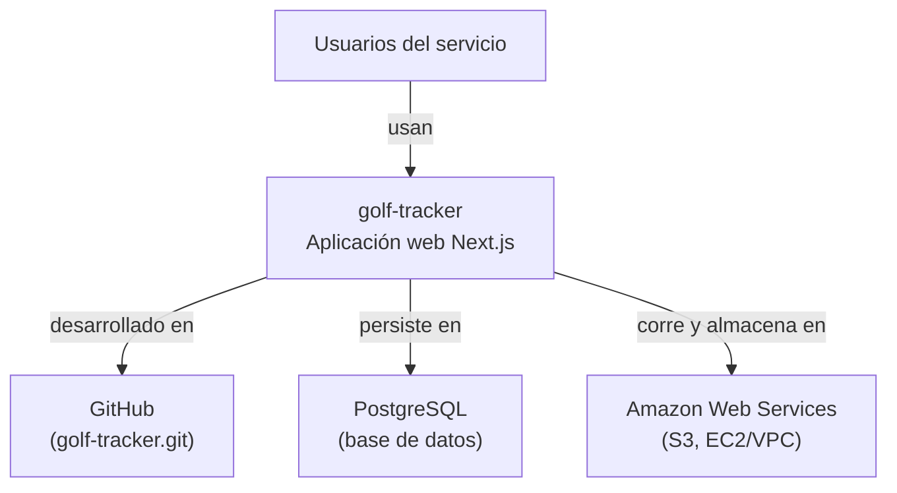
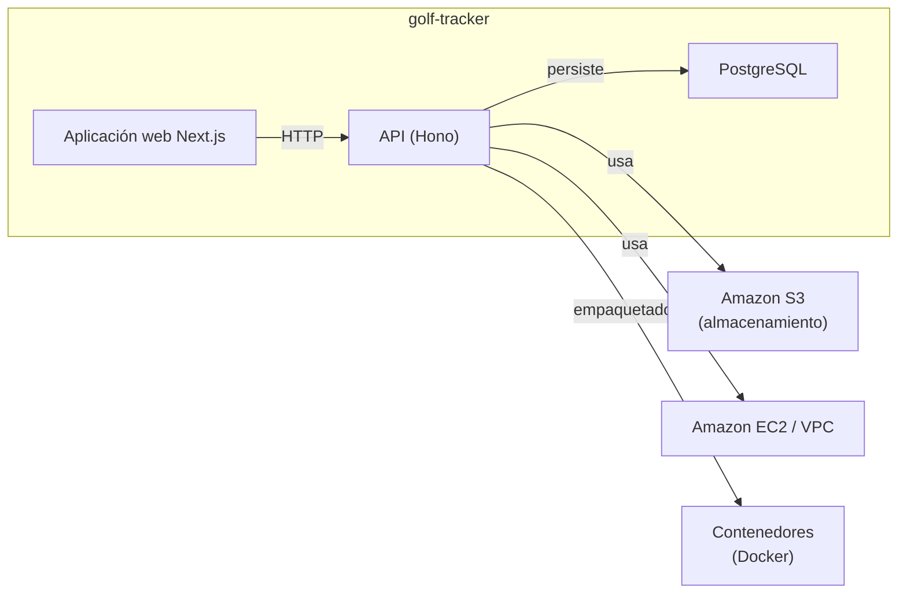

# Informe central — golf-tracker

> Auditoría generada por **VibeAudit**. Este documento reúne todos los entregables del análisis.

## 1. Datos del proyecto

- **Repositorio:** https://github.com/Andiso67/golf-tracker.git
- **Rama:** main
- **Commit:** 762de699536c4b2cb1633d8c967bd8394fe35925
- **Lenguajes:** CSS, HTML, JavaScript, TypeScript
- **Frameworks:** Next.js
- **Líneas de código:** 317021
- **Archivos de test:** 0

## 2. Resumen ejecutivo

| Sección | Hallazgos |
|---|---:|
| sast | 2 |
| secrets | 0 |
| iac | 2 |
| cicd | 0 |
| custom | 50 |
| cloud | 1 |
| llm | 0 |
| deps | 28 |
| **Total** | **83** |

**Por severidad:** HIGH x 28, MEDIUM x 54, LOW x 1

## 3. Diagrama C4 — Contexto (nivel 1)

## 4. Diagrama C4 — Contenedores (nivel 2)

## 5. Roadmap de remediación por fases

# Roadmap de remediación — golf-tracker

**Repositorio:** https://github.com/Andiso67/golf-tracker.git

**Total de hallazgos considerados:** 83

## Fase 1

Remediación inmediata (0-2 semanas): riesgos graves o explotables.

| ID | Tipo | Regla | Archivo | Severidad |
|---|---|---|---|---|
| `sast-dockerfile.security.missing-user.missing-user` | sast | `dockerfile.security.missing-user.missing-user` | Dockerfile:29 | **HIGH** |
| `sast-javascript.lang.security.detect-child-process.detect-child-process` | sast | `javascript.lang.security.detect-child-process.detect-child-process` | scripts/scrape-rfeg.js:22 | **HIGH** |
| `iac-CKV_DOCKER_2` | iac | `CKV_DOCKER_2` | Dockerfile:1 | **HIGH** |
| `iac-CKV_DOCKER_3` | iac | `CKV_DOCKER_3` | Dockerfile:1 | **HIGH** |
| `custom-vibeaudit.rules.vibe-eval` | custom | `vibeaudit.rules.vibe-eval` | scripts/extract-data.js:71 | **HIGH** |
| `custom-vibeaudit.rules.vibe-eval` | custom | `vibeaudit.rules.vibe-eval` | scripts/extract-data.js:77 | **HIGH** |
| `cloud-aws-ec2-security-group-open` | cloud | `aws-ec2-security-group-open` | sg-0b173d608eadc8fa3: | **HIGH** |
| `deps-brace-expansion@1.1.15` | deps | `brace-expansion@1.1.15` |  | **HIGH** |
| `deps-brace-expansion@1.1.15` | deps | `brace-expansion@1.1.15` |  | **HIGH** |
| `deps-brace-expansion@1.1.15` | deps | `brace-expansion@1.1.15` |  | **HIGH** |
| `deps-fast-uri@3.1.2` | deps | `fast-uri@3.1.2` |  | **HIGH** |
| `deps-fast-uri@3.1.2` | deps | `fast-uri@3.1.2` |  | **HIGH** |
| `deps-fast-uri@3.1.2` | deps | `fast-uri@3.1.2` |  | **HIGH** |
| `deps-js-yaml@4.2.0` | deps | `js-yaml@4.2.0` |  | **HIGH** |
| `deps-next@16.2.9` | deps | `next@16.2.9` |  | **HIGH** |
| `deps-next@16.2.9` | deps | `next@16.2.9` |  | **HIGH** |
| `deps-next@16.2.9` | deps | `next@16.2.9` |  | **HIGH** |
| `deps-next@16.2.9` | deps | `next@16.2.9` |  | **HIGH** |
| `deps-next@16.2.9` | deps | `next@16.2.9` |  | **HIGH** |
| `deps-next@16.2.9` | deps | `next@16.2.9` |  | **HIGH** |
| `deps-next@16.2.9` | deps | `next@16.2.9` |  | **HIGH** |
| `deps-next@16.2.9` | deps | `next@16.2.9` |  | **HIGH** |
| `deps-next@16.2.9` | deps | `next@16.2.9` |  | **HIGH** |
| `deps-postcss@8.4.31` | deps | `postcss@8.4.31` |  | **HIGH** |
| `deps-postcss@8.4.31` | deps | `postcss@8.4.31` |  | **HIGH** |
| `deps-postcss@8.4.31` | deps | `postcss@8.4.31` |  | **HIGH** |
| `deps-sharp@0.34.5` | deps | `sharp@0.34.5` |  | **HIGH** |
| `deps-valibot@1.2.0` | deps | `valibot@1.2.0` |  | **HIGH** |

## Fase 2

Remediación a corto plazo (2-6 semanas): endurecer y reducir superficie.

| ID | Tipo | Regla | Archivo | Severidad |
|---|---|---|---|---|
| `custom-vibeaudit.rules.vibe-js-console-log` | custom | `vibeaudit.rules.vibe-js-console-log` | prisma/seed.ts:33 | **MEDIUM** |
| `custom-vibeaudit.rules.vibe-js-console-log` | custom | `vibeaudit.rules.vibe-js-console-log` | prisma/seed.ts:53 | **MEDIUM** |
| `custom-vibeaudit.rules.vibe-js-console-log` | custom | `vibeaudit.rules.vibe-js-console-log` | prisma/seed.ts:61 | **MEDIUM** |
| `custom-vibeaudit.rules.vibe-js-console-log` | custom | `vibeaudit.rules.vibe-js-console-log` | prisma/seed.ts:75 | **MEDIUM** |
| `custom-vibeaudit.rules.vibe-js-console-log` | custom | `vibeaudit.rules.vibe-js-console-log` | prisma/seed.ts:106 | **MEDIUM** |
| `custom-vibeaudit.rules.vibe-js-console-log` | custom | `vibeaudit.rules.vibe-js-console-log` | prisma/seed.ts:131 | **MEDIUM** |
| `custom-vibeaudit.rules.vibe-js-console-log` | custom | `vibeaudit.rules.vibe-js-console-log` | prisma/seed.ts:158 | **MEDIUM** |
| `custom-vibeaudit.rules.vibe-js-console-log` | custom | `vibeaudit.rules.vibe-js-console-log` | prisma/seed.ts:217 | **MEDIUM** |
| `custom-vibeaudit.rules.vibe-js-console-log` | custom | `vibeaudit.rules.vibe-js-console-log` | prisma/seed.ts:230 | **MEDIUM** |
| `custom-vibeaudit.rules.vibe-js-console-log` | custom | `vibeaudit.rules.vibe-js-console-log` | prisma/seed.ts:232 | **MEDIUM** |
| `custom-vibeaudit.rules.vibe-js-console-log` | custom | `vibeaudit.rules.vibe-js-console-log` | scripts/extract-data.js:61 | **MEDIUM** |
| `custom-vibeaudit.rules.vibe-js-console-log` | custom | `vibeaudit.rules.vibe-js-console-log` | scripts/extract-data.js:79 | **MEDIUM** |
| `custom-vibeaudit.rules.vibe-js-console-log` | custom | `vibeaudit.rules.vibe-js-console-log` | scripts/extract-data.js:84 | **MEDIUM** |
| `custom-vibeaudit.rules.vibe-js-console-log` | custom | `vibeaudit.rules.vibe-js-console-log` | scripts/extract-data.js:85 | **MEDIUM** |
| `custom-vibeaudit.rules.vibe-js-console-log` | custom | `vibeaudit.rules.vibe-js-console-log` | scripts/extract-data.js:90 | **MEDIUM** |
| `custom-vibeaudit.rules.vibe-js-console-log` | custom | `vibeaudit.rules.vibe-js-console-log` | scripts/extract-data.js:95 | **MEDIUM** |
| `custom-vibeaudit.rules.vibe-js-console-log` | custom | `vibeaudit.rules.vibe-js-console-log` | scripts/extract-data.js:100 | **MEDIUM** |
| `custom-vibeaudit.rules.vibe-js-console-log` | custom | `vibeaudit.rules.vibe-js-console-log` | scripts/extract-data.js:109 | **MEDIUM** |
| `custom-vibeaudit.rules.vibe-js-console-log` | custom | `vibeaudit.rules.vibe-js-console-log` | scripts/extract-data.js:112 | **MEDIUM** |
| `custom-vibeaudit.rules.vibe-js-console-log` | custom | `vibeaudit.rules.vibe-js-console-log` | scripts/extract-data.js:115 | **MEDIUM** |
| `custom-vibeaudit.rules.vibe-js-console-log` | custom | `vibeaudit.rules.vibe-js-console-log` | scripts/scrape-rfeg.js:138 | **MEDIUM** |
| `custom-vibeaudit.rules.vibe-js-console-log` | custom | `vibeaudit.rules.vibe-js-console-log` | scripts/scrape-rfeg.js:140 | **MEDIUM** |
| `custom-vibeaudit.rules.vibe-js-console-log` | custom | `vibeaudit.rules.vibe-js-console-log` | scripts/scrape-rfeg.js:142 | **MEDIUM** |
| `custom-vibeaudit.rules.vibe-js-console-log` | custom | `vibeaudit.rules.vibe-js-console-log` | scripts/scrape-rfeg.js:144 | **MEDIUM** |
| `custom-vibeaudit.rules.vibe-js-console-log` | custom | `vibeaudit.rules.vibe-js-console-log` | scripts/scrape-rfeg.js:148 | **MEDIUM** |
| `custom-vibeaudit.rules.vibe-js-console-log` | custom | `vibeaudit.rules.vibe-js-console-log` | scripts/scrape-rfeg.js:160 | **MEDIUM** |
| `custom-vibeaudit.rules.vibe-js-console-log` | custom | `vibeaudit.rules.vibe-js-console-log` | scripts/scrape-rfeg.js:170 | **MEDIUM** |
| `custom-vibeaudit.rules.vibe-js-console-log` | custom | `vibeaudit.rules.vibe-js-console-log` | scripts/scrape-rfeg.js:203 | **MEDIUM** |
| `custom-vibeaudit.rules.vibe-js-console-log` | custom | `vibeaudit.rules.vibe-js-console-log` | scripts/scrape-rfeg.js:205 | **MEDIUM** |
| `custom-vibeaudit.rules.vibe-js-console-log` | custom | `vibeaudit.rules.vibe-js-console-log` | scripts/scrape-rfeg.js:222 | **MEDIUM** |
| `custom-vibeaudit.rules.vibe-js-console-log` | custom | `vibeaudit.rules.vibe-js-console-log` | scripts/scrape-rfeg.js:223 | **MEDIUM** |
| `custom-vibeaudit.rules.vibe-js-console-log` | custom | `vibeaudit.rules.vibe-js-console-log` | scripts/scrape-rfeg.js:224 | **MEDIUM** |
| `custom-vibeaudit.rules.vibe-js-console-log` | custom | `vibeaudit.rules.vibe-js-console-log` | scripts/scrape-rfeg.js:225 | **MEDIUM** |
| `custom-vibeaudit.rules.vibe-js-console-log` | custom | `vibeaudit.rules.vibe-js-console-log` | scripts/seed.ts:10 | **MEDIUM** |
| `custom-vibeaudit.rules.vibe-js-console-log` | custom | `vibeaudit.rules.vibe-js-console-log` | scripts/seed.ts:11 | **MEDIUM** |
| `custom-vibeaudit.rules.vibe-js-console-log` | custom | `vibeaudit.rules.vibe-js-console-log` | scripts/seed.ts:16 | **MEDIUM** |
| `custom-vibeaudit.rules.vibe-js-console-log` | custom | `vibeaudit.rules.vibe-js-console-log` | scripts/seed.ts:42 | **MEDIUM** |
| `custom-vibeaudit.rules.vibe-js-console-log` | custom | `vibeaudit.rules.vibe-js-console-log` | scripts/seed.ts:56 | **MEDIUM** |
| `custom-vibeaudit.rules.vibe-js-console-log` | custom | `vibeaudit.rules.vibe-js-console-log` | scripts/seed.ts:74 | **MEDIUM** |
| `custom-vibeaudit.rules.vibe-js-console-log` | custom | `vibeaudit.rules.vibe-js-console-log` | scripts/seed.ts:128 | **MEDIUM** |
| `custom-vibeaudit.rules.vibe-js-console-log` | custom | `vibeaudit.rules.vibe-js-console-log` | scripts/seed.ts:174 | **MEDIUM** |
| `custom-vibeaudit.rules.vibe-js-console-log` | custom | `vibeaudit.rules.vibe-js-console-log` | scripts/seed.ts:176 | **MEDIUM** |
| `custom-vibeaudit.rules.vibe-js-console-log` | custom | `vibeaudit.rules.vibe-js-console-log` | scripts/seed.ts:177 | **MEDIUM** |
| `custom-vibeaudit.rules.vibe-js-console-log` | custom | `vibeaudit.rules.vibe-js-console-log` | src/app/api/auth/forgot-password/route.ts:31 | **MEDIUM** |
| `custom-vibeaudit.rules.vibe-js-console-log` | custom | `vibeaudit.rules.vibe-js-console-log` | src/app/api/auth/register/route.ts:45 | **MEDIUM** |
| `custom-vibeaudit.rules.vibe-ts-non-null-assertion` | custom | `vibeaudit.rules.vibe-ts-non-null-assertion` | src/store/useStore.ts:138 | **MEDIUM** |
| `custom-vibeaudit.rules.vibe-ts-non-null-assertion` | custom | `vibeaudit.rules.vibe-ts-non-null-assertion` | src/store/useStore.ts:389 | **MEDIUM** |
| `deps-@hono/node-server@1.19.11` | deps | `@hono/node-server@1.19.11` |  | **MEDIUM** |
| `deps-@hono/node-server@1.19.11` | deps | `@hono/node-server@1.19.11` |  | **MEDIUM** |
| `deps-hono@4.12.26` | deps | `hono@4.12.26` |  | **MEDIUM** |
| `deps-hono@4.12.26` | deps | `hono@4.12.26` |  | **MEDIUM** |
| `deps-hono@4.12.26` | deps | `hono@4.12.26` |  | **MEDIUM** |
| `deps-hono@4.12.26` | deps | `hono@4.12.26` |  | **MEDIUM** |
| `deps-postcss@8.4.31` | deps | `postcss@8.4.31` |  | **MEDIUM** |

## Fase 3

Mejora continua (más de 6 semanas): higiene y deuda técnica.

| ID | Tipo | Regla | Archivo | Severidad |
|---|---|---|---|---|
| `custom-vibeaudit.rules.vibe-todo-fixme` | custom | `vibeaudit.rules.vibe-todo-fixme` | Prueba.md:208 | **LOW** |

## 6. Backlog de remediación

| ID | Tipo | Regla | Archivo | Severidad | Recomendación |
|---|---|---|---|---|---|
| `sast-dockerfile.security.missing-user.missing-user` | sast | `dockerfile.security.missing-user.missing-user` | Dockerfile:29 | **HIGH** | Revisar el hallazgo y aplicar la regla / patch correspondiente. |
| `sast-javascript.lang.security.detect-child-process.detect-child-process` | sast | `javascript.lang.security.detect-child-process.detect-child-process` | scripts/scrape-rfeg.js:22 | **HIGH** | Revisar el hallazgo y aplicar la regla / patch correspondiente. |
| `iac-CKV_DOCKER_2` | iac | `CKV_DOCKER_2` | Dockerfile:1 | **HIGH** | Corregir la configuración de infraestructura señalada. |
| `iac-CKV_DOCKER_3` | iac | `CKV_DOCKER_3` | Dockerfile:1 | **HIGH** | Corregir la configuración de infraestructura señalada. |
| `custom-vibeaudit.rules.vibe-todo-fixme` | custom | `vibeaudit.rules.vibe-todo-fixme` | Prueba.md:208 | **LOW** | Aplicar la convención 'Vibe Coding' incumplida. |
| `custom-vibeaudit.rules.vibe-js-console-log` | custom | `vibeaudit.rules.vibe-js-console-log` | prisma/seed.ts:33 | **MEDIUM** | Aplicar la convención 'Vibe Coding' incumplida. |
| `custom-vibeaudit.rules.vibe-js-console-log` | custom | `vibeaudit.rules.vibe-js-console-log` | prisma/seed.ts:53 | **MEDIUM** | Aplicar la convención 'Vibe Coding' incumplida. |
| `custom-vibeaudit.rules.vibe-js-console-log` | custom | `vibeaudit.rules.vibe-js-console-log` | prisma/seed.ts:61 | **MEDIUM** | Aplicar la convención 'Vibe Coding' incumplida. |
| `custom-vibeaudit.rules.vibe-js-console-log` | custom | `vibeaudit.rules.vibe-js-console-log` | prisma/seed.ts:75 | **MEDIUM** | Aplicar la convención 'Vibe Coding' incumplida. |
| `custom-vibeaudit.rules.vibe-js-console-log` | custom | `vibeaudit.rules.vibe-js-console-log` | prisma/seed.ts:106 | **MEDIUM** | Aplicar la convención 'Vibe Coding' incumplida. |
| `custom-vibeaudit.rules.vibe-js-console-log` | custom | `vibeaudit.rules.vibe-js-console-log` | prisma/seed.ts:131 | **MEDIUM** | Aplicar la convención 'Vibe Coding' incumplida. |
| `custom-vibeaudit.rules.vibe-js-console-log` | custom | `vibeaudit.rules.vibe-js-console-log` | prisma/seed.ts:158 | **MEDIUM** | Aplicar la convención 'Vibe Coding' incumplida. |
| `custom-vibeaudit.rules.vibe-js-console-log` | custom | `vibeaudit.rules.vibe-js-console-log` | prisma/seed.ts:217 | **MEDIUM** | Aplicar la convención 'Vibe Coding' incumplida. |
| `custom-vibeaudit.rules.vibe-js-console-log` | custom | `vibeaudit.rules.vibe-js-console-log` | prisma/seed.ts:230 | **MEDIUM** | Aplicar la convención 'Vibe Coding' incumplida. |
| `custom-vibeaudit.rules.vibe-js-console-log` | custom | `vibeaudit.rules.vibe-js-console-log` | prisma/seed.ts:232 | **MEDIUM** | Aplicar la convención 'Vibe Coding' incumplida. |
| `custom-vibeaudit.rules.vibe-js-console-log` | custom | `vibeaudit.rules.vibe-js-console-log` | scripts/extract-data.js:61 | **MEDIUM** | Aplicar la convención 'Vibe Coding' incumplida. |
| `custom-vibeaudit.rules.vibe-eval` | custom | `vibeaudit.rules.vibe-eval` | scripts/extract-data.js:71 | **HIGH** | Aplicar la convención 'Vibe Coding' incumplida. |
| `custom-vibeaudit.rules.vibe-eval` | custom | `vibeaudit.rules.vibe-eval` | scripts/extract-data.js:77 | **HIGH** | Aplicar la convención 'Vibe Coding' incumplida. |
| `custom-vibeaudit.rules.vibe-js-console-log` | custom | `vibeaudit.rules.vibe-js-console-log` | scripts/extract-data.js:79 | **MEDIUM** | Aplicar la convención 'Vibe Coding' incumplida. |
| `custom-vibeaudit.rules.vibe-js-console-log` | custom | `vibeaudit.rules.vibe-js-console-log` | scripts/extract-data.js:84 | **MEDIUM** | Aplicar la convención 'Vibe Coding' incumplida. |
| `custom-vibeaudit.rules.vibe-js-console-log` | custom | `vibeaudit.rules.vibe-js-console-log` | scripts/extract-data.js:85 | **MEDIUM** | Aplicar la convención 'Vibe Coding' incumplida. |
| `custom-vibeaudit.rules.vibe-js-console-log` | custom | `vibeaudit.rules.vibe-js-console-log` | scripts/extract-data.js:90 | **MEDIUM** | Aplicar la convención 'Vibe Coding' incumplida. |
| `custom-vibeaudit.rules.vibe-js-console-log` | custom | `vibeaudit.rules.vibe-js-console-log` | scripts/extract-data.js:95 | **MEDIUM** | Aplicar la convención 'Vibe Coding' incumplida. |
| `custom-vibeaudit.rules.vibe-js-console-log` | custom | `vibeaudit.rules.vibe-js-console-log` | scripts/extract-data.js:100 | **MEDIUM** | Aplicar la convención 'Vibe Coding' incumplida. |
| `custom-vibeaudit.rules.vibe-js-console-log` | custom | `vibeaudit.rules.vibe-js-console-log` | scripts/extract-data.js:109 | **MEDIUM** | Aplicar la convención 'Vibe Coding' incumplida. |
| `custom-vibeaudit.rules.vibe-js-console-log` | custom | `vibeaudit.rules.vibe-js-console-log` | scripts/extract-data.js:112 | **MEDIUM** | Aplicar la convención 'Vibe Coding' incumplida. |
| `custom-vibeaudit.rules.vibe-js-console-log` | custom | `vibeaudit.rules.vibe-js-console-log` | scripts/extract-data.js:115 | **MEDIUM** | Aplicar la convención 'Vibe Coding' incumplida. |
| `custom-vibeaudit.rules.vibe-js-console-log` | custom | `vibeaudit.rules.vibe-js-console-log` | scripts/scrape-rfeg.js:138 | **MEDIUM** | Aplicar la convención 'Vibe Coding' incumplida. |
| `custom-vibeaudit.rules.vibe-js-console-log` | custom | `vibeaudit.rules.vibe-js-console-log` | scripts/scrape-rfeg.js:140 | **MEDIUM** | Aplicar la convención 'Vibe Coding' incumplida. |
| `custom-vibeaudit.rules.vibe-js-console-log` | custom | `vibeaudit.rules.vibe-js-console-log` | scripts/scrape-rfeg.js:142 | **MEDIUM** | Aplicar la convención 'Vibe Coding' incumplida. |
| `custom-vibeaudit.rules.vibe-js-console-log` | custom | `vibeaudit.rules.vibe-js-console-log` | scripts/scrape-rfeg.js:144 | **MEDIUM** | Aplicar la convención 'Vibe Coding' incumplida. |
| `custom-vibeaudit.rules.vibe-js-console-log` | custom | `vibeaudit.rules.vibe-js-console-log` | scripts/scrape-rfeg.js:148 | **MEDIUM** | Aplicar la convención 'Vibe Coding' incumplida. |
| `custom-vibeaudit.rules.vibe-js-console-log` | custom | `vibeaudit.rules.vibe-js-console-log` | scripts/scrape-rfeg.js:160 | **MEDIUM** | Aplicar la convención 'Vibe Coding' incumplida. |
| `custom-vibeaudit.rules.vibe-js-console-log` | custom | `vibeaudit.rules.vibe-js-console-log` | scripts/scrape-rfeg.js:170 | **MEDIUM** | Aplicar la convención 'Vibe Coding' incumplida. |
| `custom-vibeaudit.rules.vibe-js-console-log` | custom | `vibeaudit.rules.vibe-js-console-log` | scripts/scrape-rfeg.js:203 | **MEDIUM** | Aplicar la convención 'Vibe Coding' incumplida. |
| `custom-vibeaudit.rules.vibe-js-console-log` | custom | `vibeaudit.rules.vibe-js-console-log` | scripts/scrape-rfeg.js:205 | **MEDIUM** | Aplicar la convención 'Vibe Coding' incumplida. |
| `custom-vibeaudit.rules.vibe-js-console-log` | custom | `vibeaudit.rules.vibe-js-console-log` | scripts/scrape-rfeg.js:222 | **MEDIUM** | Aplicar la convención 'Vibe Coding' incumplida. |
| `custom-vibeaudit.rules.vibe-js-console-log` | custom | `vibeaudit.rules.vibe-js-console-log` | scripts/scrape-rfeg.js:223 | **MEDIUM** | Aplicar la convención 'Vibe Coding' incumplida. |
| `custom-vibeaudit.rules.vibe-js-console-log` | custom | `vibeaudit.rules.vibe-js-console-log` | scripts/scrape-rfeg.js:224 | **MEDIUM** | Aplicar la convención 'Vibe Coding' incumplida. |
| `custom-vibeaudit.rules.vibe-js-console-log` | custom | `vibeaudit.rules.vibe-js-console-log` | scripts/scrape-rfeg.js:225 | **MEDIUM** | Aplicar la convención 'Vibe Coding' incumplida. |
| `custom-vibeaudit.rules.vibe-js-console-log` | custom | `vibeaudit.rules.vibe-js-console-log` | scripts/seed.ts:10 | **MEDIUM** | Aplicar la convención 'Vibe Coding' incumplida. |
| `custom-vibeaudit.rules.vibe-js-console-log` | custom | `vibeaudit.rules.vibe-js-console-log` | scripts/seed.ts:11 | **MEDIUM** | Aplicar la convención 'Vibe Coding' incumplida. |
| `custom-vibeaudit.rules.vibe-js-console-log` | custom | `vibeaudit.rules.vibe-js-console-log` | scripts/seed.ts:16 | **MEDIUM** | Aplicar la convención 'Vibe Coding' incumplida. |
| `custom-vibeaudit.rules.vibe-js-console-log` | custom | `vibeaudit.rules.vibe-js-console-log` | scripts/seed.ts:42 | **MEDIUM** | Aplicar la convención 'Vibe Coding' incumplida. |
| `custom-vibeaudit.rules.vibe-js-console-log` | custom | `vibeaudit.rules.vibe-js-console-log` | scripts/seed.ts:56 | **MEDIUM** | Aplicar la convención 'Vibe Coding' incumplida. |
| `custom-vibeaudit.rules.vibe-js-console-log` | custom | `vibeaudit.rules.vibe-js-console-log` | scripts/seed.ts:74 | **MEDIUM** | Aplicar la convención 'Vibe Coding' incumplida. |
| `custom-vibeaudit.rules.vibe-js-console-log` | custom | `vibeaudit.rules.vibe-js-console-log` | scripts/seed.ts:128 | **MEDIUM** | Aplicar la convención 'Vibe Coding' incumplida. |
| `custom-vibeaudit.rules.vibe-js-console-log` | custom | `vibeaudit.rules.vibe-js-console-log` | scripts/seed.ts:174 | **MEDIUM** | Aplicar la convención 'Vibe Coding' incumplida. |
| `custom-vibeaudit.rules.vibe-js-console-log` | custom | `vibeaudit.rules.vibe-js-console-log` | scripts/seed.ts:176 | **MEDIUM** | Aplicar la convención 'Vibe Coding' incumplida. |
| `custom-vibeaudit.rules.vibe-js-console-log` | custom | `vibeaudit.rules.vibe-js-console-log` | scripts/seed.ts:177 | **MEDIUM** | Aplicar la convención 'Vibe Coding' incumplida. |
| `custom-vibeaudit.rules.vibe-js-console-log` | custom | `vibeaudit.rules.vibe-js-console-log` | src/app/api/auth/forgot-password/route.ts:31 | **MEDIUM** | Aplicar la convención 'Vibe Coding' incumplida. |
| `custom-vibeaudit.rules.vibe-js-console-log` | custom | `vibeaudit.rules.vibe-js-console-log` | src/app/api/auth/register/route.ts:45 | **MEDIUM** | Aplicar la convención 'Vibe Coding' incumplida. |
| `custom-vibeaudit.rules.vibe-ts-non-null-assertion` | custom | `vibeaudit.rules.vibe-ts-non-null-assertion` | src/store/useStore.ts:138 | **MEDIUM** | Aplicar la convención 'Vibe Coding' incumplida. |
| `custom-vibeaudit.rules.vibe-ts-non-null-assertion` | custom | `vibeaudit.rules.vibe-ts-non-null-assertion` | src/store/useStore.ts:389 | **MEDIUM** | Aplicar la convención 'Vibe Coding' incumplida. |
| `cloud-aws-ec2-security-group-open` | cloud | `aws-ec2-security-group-open` | sg-0b173d608eadc8fa3: | **HIGH** | El security group permite tráfico desde 0.0.0.0/0. Restrinje la entrada al rango |
| `deps-@hono/node-server@1.19.11` | deps | `@hono/node-server@1.19.11` | — | **MEDIUM** | Corregir dependencia @hono/node-server@1.19.11; disponible en 1.19.13 |
| `deps-@hono/node-server@1.19.11` | deps | `@hono/node-server@1.19.11` | — | **MEDIUM** | Corregir dependencia @hono/node-server@1.19.11; disponible en 2.0.5 |
| `deps-brace-expansion@1.1.15` | deps | `brace-expansion@1.1.15` | — | **HIGH** | Corregir dependencia brace-expansion@1.1.15; disponible en 1.1.16 |
| `deps-brace-expansion@1.1.15` | deps | `brace-expansion@1.1.15` | — | **HIGH** | Corregir dependencia brace-expansion@1.1.15; disponible en 1.1.17 |
| `deps-brace-expansion@1.1.15` | deps | `brace-expansion@1.1.15` | — | **HIGH** | Corregir dependencia brace-expansion@1.1.15; disponible en 1.1.18 |
| `deps-fast-uri@3.1.2` | deps | `fast-uri@3.1.2` | — | **HIGH** | Corregir dependencia fast-uri@3.1.2; disponible en 3.1.3 |
| `deps-fast-uri@3.1.2` | deps | `fast-uri@3.1.2` | — | **HIGH** | Corregir dependencia fast-uri@3.1.2; disponible en 3.1.5 |
| `deps-fast-uri@3.1.2` | deps | `fast-uri@3.1.2` | — | **HIGH** | Corregir dependencia fast-uri@3.1.2; disponible en 3.1.4 |
| `deps-hono@4.12.26` | deps | `hono@4.12.26` | — | **MEDIUM** | Corregir dependencia hono@4.12.26; disponible en 4.12.34 |
| `deps-hono@4.12.26` | deps | `hono@4.12.26` | — | **MEDIUM** | Corregir dependencia hono@4.12.26; disponible en 4.12.27 |
| `deps-hono@4.12.26` | deps | `hono@4.12.26` | — | **MEDIUM** | Corregir dependencia hono@4.12.26; disponible en 4.12.27 |
| `deps-hono@4.12.26` | deps | `hono@4.12.26` | — | **MEDIUM** | Corregir dependencia hono@4.12.26; disponible en 4.12.27 |
| `deps-js-yaml@4.2.0` | deps | `js-yaml@4.2.0` | — | **HIGH** | Corregir dependencia js-yaml@4.2.0; disponible en 4.3.0 |
| `deps-next@16.2.9` | deps | `next@16.2.9` | — | **HIGH** | Corregir dependencia next@16.2.9; disponible en 16.2.11 |
| `deps-next@16.2.9` | deps | `next@16.2.9` | — | **HIGH** | Corregir dependencia next@16.2.9; disponible en 16.2.11 |
| `deps-next@16.2.9` | deps | `next@16.2.9` | — | **HIGH** | Corregir dependencia next@16.2.9; disponible en 16.2.11 |
| `deps-next@16.2.9` | deps | `next@16.2.9` | — | **HIGH** | Corregir dependencia next@16.2.9; disponible en 16.2.11 |
| `deps-next@16.2.9` | deps | `next@16.2.9` | — | **HIGH** | Corregir dependencia next@16.2.9; disponible en 16.2.11 |
| `deps-next@16.2.9` | deps | `next@16.2.9` | — | **HIGH** | Corregir dependencia next@16.2.9; disponible en 16.2.11 |
| `deps-next@16.2.9` | deps | `next@16.2.9` | — | **HIGH** | Corregir dependencia next@16.2.9; disponible en 16.2.11 |
| `deps-next@16.2.9` | deps | `next@16.2.9` | — | **HIGH** | Corregir dependencia next@16.2.9; disponible en 16.2.11 |
| `deps-next@16.2.9` | deps | `next@16.2.9` | — | **HIGH** | Corregir dependencia next@16.2.9; disponible en 16.2.11 |
| `deps-postcss@8.4.31` | deps | `postcss@8.4.31` | — | **HIGH** | Corregir dependencia postcss@8.4.31; disponible en 8.5.12 |
| `deps-postcss@8.4.31` | deps | `postcss@8.4.31` | — | **HIGH** | Corregir dependencia postcss@8.4.31; disponible en 8.5.23 |
| `deps-postcss@8.4.31` | deps | `postcss@8.4.31` | — | **MEDIUM** | Corregir dependencia postcss@8.4.31; disponible en 8.5.10 |
| `deps-postcss@8.4.31` | deps | `postcss@8.4.31` | — | **HIGH** | Corregir dependencia postcss@8.4.31; disponible en 8.5.18 |
| `deps-sharp@0.34.5` | deps | `sharp@0.34.5` | — | **HIGH** | Corregir dependencia sharp@0.34.5; disponible en 0.35.0 |
| `deps-valibot@1.2.0` | deps | `valibot@1.2.0` | — | **HIGH** | Corregir dependencia valibot@1.2.0; disponible en 1.4.2 |

## 7. Entregables descargables

Los entregables individuales se generan junto a este informe. Pulsa el enlace (desde el mismo directorio) para abrirlos:

- [`c4-context.mmd`](./c4-context.mmd) — diagrama de contexto (Mermaid).
- [`c4-container.mmd`](./c4-container.mmd) — diagrama de contenedores (Mermaid).
- [`roadmap.md`](./roadmap.md) — roadmap por fases según severidad.
- [`backlog.csv`](./backlog.csv) — backlog de remediación (CSV).
- [`backlog.json`](./backlog.json) — backlog de remediación (JSON).
